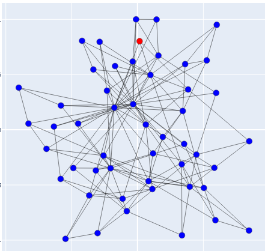

# stompx

**stompx** is a Python framework for simulating, analyzing, and visualizing
stochastic spreading processes on networks.

The library is designed to support research and teaching in areas such as
epidemic modeling, information diffusion, and malware propagation in IoT networks.

## Installation

The package can be installed locally from the GitHub repository:
git clone https://github.com/<username>/stompx.git
cd stompx
pip install -e .

## Examples

A short usage example is provided in a Jupyter notebook.

## License

This project is licensed under the MIT License.

## Citation

If you use this software, please cite the accompanying SoftwareX article.

